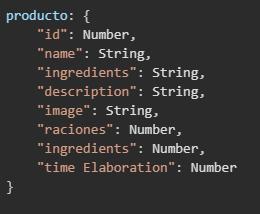

# RECIPE PROJECT VUE
Repositorio realizado por: https://www.linkedin.com/in/montse-cobes-orteu-31b058233/

# Description

This project is an online recipe book application that offers users the ability to create, modify, and delete recipes in a simple and accessible manner. Users can register, log in, and effectively manage their favorite recipes.

The application is built with **Vue.js**, using **Vue Router** to facilitate navigation between different views, and **Pinia** for state management. This approach ensures that users have full control over their content, allowing them to only modify or delete recipes they have created themselves.

## Key Features:
- **Register/Log In**: Users can register or log in to access their collection of recipes.
- **Create Recipe**: Provides an intuitive form for users to add new recipes to their repertoire.
- **Modify Recipe**: Users can make changes to their recipes directly from their profile.
- **Delete Recipe**: Offers the option to delete recipes that they no longer wish to keep.

## Project Architecture

Below is the mental structure before starting the project:

0. **Functionality**
    - Main page
        - Registration
        - Recipe presentation
        - Access to more recipes
1. **Stores**
    - RecipesStore -> API to receive recipes
2. **Routes and Views**
    - `/` -> HOME -> Presentation 
        - INSIDE ACCESS TO REGISTRATION 
            - My recipes and favorite saved recipes appear
        - CREATE NEW USER
    - `/list` -> LIST-RECIPES -> All recipes 
        - `/list/id/details` ACCESS RECIPE DETAILS
        - ADD OR MODIFY RECIPE
3. **Components**
    - Recipe Card -> F: Add, hide, delete
    - SearchBar -> F: Filter and reorder
    - Favourite recipes
    - Header and Footer

## Objects

### Product
The product object is defined from the backend as follows: 

## Technologies Used

This project has been developed using a variety of technologies and languages that facilitate the creation and management of the recipe book application. Below are the tools used and their purpose:

### Frontend
- **Vue.js**: A progressive JavaScript framework for building user interfaces. It allows for the efficient creation of interactive applications.
- **Vue Router**: A library for navigation in Vue.js applications. It facilitates the management of routes and views within the application.
- **Pinia**: A state store for Vue.js applications that enables reactive and straightforward state management.

### Backend
- **Node.js**: A JavaScript runtime environment on the server that allows for executing JavaScript code outside of the browser.
- **Express**: A Node.js framework that simplifies the creation of web applications and APIs, providing a robust set of features for handling routes and middleware.
- **JSON Web Tokens (JWT)**: A token-based authentication method that allows users to log in and securely access protected functionalities of the application.

### Database
- **NoSQL Database (e.g., MongoDB)**: Used to store recipes and user data. A flexible and scalable approach is utilized for data handling.

### Others
- **HTML/CSS**: Languages used for the structure and design of the user interface.
- **JavaScript**: A programming language used on both the frontend and backend to manage the application logic.

These technologies work together to provide a smooth user experience and effective data management, ensuring that users can interact with the application intuitively.

## FrontEnd

### Project Structure

#### Application Views
- **HomeView.vue**: Welcome view that displays an introduction to the application and a carousel of featured recipes.
- **RecipeListView.vue**: View that shows a list of all recipes available in the application.
- **RecipeDetailView.vue**: View that shows the details of a specific recipe.
- **RecipeFormUserView.vue**: View that allows users to register or log in.
- **CreateRecipeView.vue**: View that allows users to create new recipes.
- **ModifyRecipeView.vue**: View that allows users to modify existing recipes.
- **UserView.vue**: View that shows the recipes created by the user and options to modify or delete them.

#### Components
- **NavbarComponent.vue**: Navigation bar component.
- **FooterComponent.vue**: Footer component.
- **CreateRecipeComponent.vue**: Component for creating recipes.
- **UpdateRecipeComponent.vue**: Component for updating recipes.
- **SlideComponent.vue**: Component for displaying recipes in a carousel.
- **RecipeCardComponent.vue**: Component that displays recipe cards.

### Storage (Store)
- **Recipes Store**: Uses Pinia to manage the state of recipes, including creation, retrieval, modification, and deletion of recipes.

### Routes (Router)
The application's routes are defined in the `router/index.js` file, which includes the following:

- `/`: Home route that loads **HomeView**.
- `/list`: Route that loads **RecipeListView**.
- `/details/:id`: Route that loads **RecipeDetailView** to view details of a specific recipe.
- `/form-user`: Route for user registration and login.
- `/create`: Route for creating a new recipe.
- `/modify/:id`: Route for modifying an existing recipe.
- `/user`: Route for displaying the user's recipes.

## Backend

The backend of the application is built with **Node.js** and **Express**, providing a RESTful API for managing recipes and users.

### Backend Structure

#### API Endpoints:
- **Users**:
  - `POST /api/users/register`: Registers a new user.
  - `GET /api/users/name/:id`: Retrieves information about a user by their ID.
  - `POST /api/login`: Authenticates a user and generates an access token.

- **Recipes**:
  - `GET /api/recipes`: Retrieves all recipes.
  - `POST /api/recipes`: Creates a new recipe (only for authenticated users).
  - `GET /api/recipes/:id`: Retrieves the details of a specific recipe.
  - `PATCH /api/recipes/change/:id/:username`: Modifies an existing recipe (only if created by the authenticated user).
  - `DELETE /api/recipes/delete/:id/:username`: Deletes an existing recipe (only if created by the authenticated user).

### Authentication
User authentication is performed through a **JWT** (JSON Web Tokens) token system, allowing users to log in and obtain a token to access the protected functionalities of the application.

## Contributions
If you would like to contribute to the project, please follow these steps:

1. Fork the repository.
2. Create a new branch (git checkout -b new-feature).
3. Make your changes and commit (git commit -m 'Add new feature').
4. Push to the branch (git push origin new-feature).
5. Open a Pull Request.
